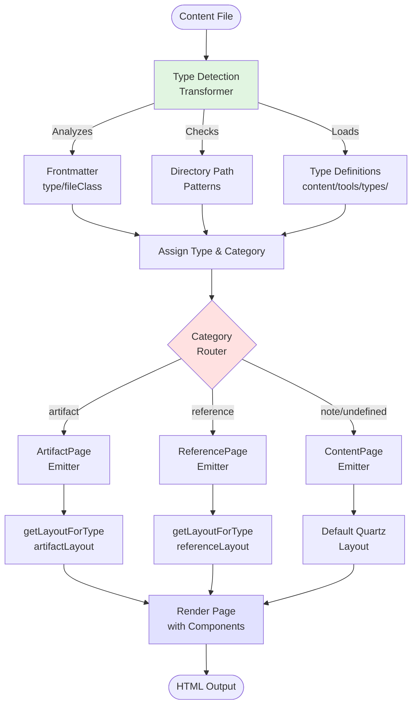
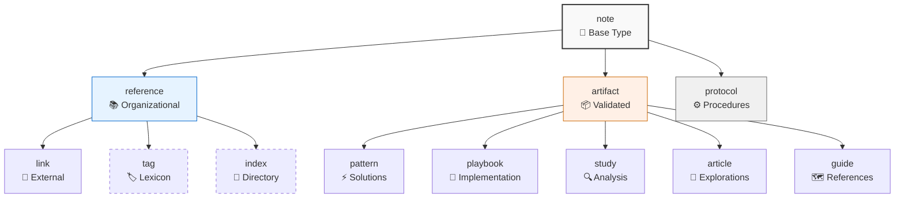
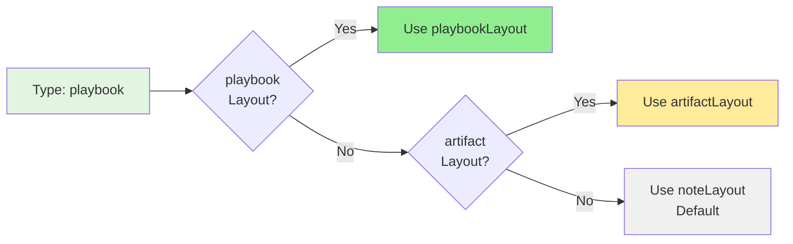

# Type-Aware Layouts

The Type-Aware Layout system extends Quartz's core emitter pattern to automatically apply different page layouts based on content type detection. The system provides full control over which components appear in each page section (beforeBody, left sidebar, right sidebar, etc.) based on file type, while maintaining complete backward compatibility with default Quartz behavior.

## Architecture Overview

The system operates through a three-stage pipeline:



### Stage 1: Type Detection
During the transformation phase, each content file is analyzed to determine its content type and category classification using frontmatter, directory paths, and type definitions.

### Stage 2: Category-Based Routing  
Content is routed to specialized category emitters (ArtifactPage, ReferencePage) based on detected type category, while note types bypass the system entirely.

### Stage 3: Layout-Based Rendering
Each emitter uses `getLayoutForType()` to select appropriate page layouts that control which components appear in each page section.

## Core Components

### Type System
- **`quartz/types/typeRegistry.ts`** - Central type management and category classification
- **`quartz/types/typeLoader.ts`** - Loads type definitions from `content/tools/types/*.md`  
- **`quartz/plugins/transformers/typeDetection.ts`** - Detects and assigns types during build
- **`content/tools/types/*.md`** - Dynamic type definition files

### Layout System
- **`quartz/types/typeLayouts.ts`** - Defines page layouts for each content type, specifying which components appear in each section (beforeBody, left, right, etc.)
- **`quartz/components/TypeBadge.tsx`** - Simple component that displays type badges in beforeBody section

### Custom Emitters
- **`quartz/plugins/emitters/artifactPage.tsx`** - Processes artifact category files using type-specific layouts
- **`quartz/plugins/emitters/referencePage.tsx`** - Processes reference category files using type-specific layouts

## How It Works

1. **Type Detection**: Files are analyzed and assigned `detectedType` and `typeCategory`
2. **Category Routing**: 
   - `typeCategory === "artifact"` → Processed by ArtifactPage emitter
   - `typeCategory === "reference"` → Processed by ReferencePage emitter  
   - `typeCategory === "note"` or no type → **Bypasses system**, processed by default ContentPage emitter
3. **Layout Selection**: Emitters call `getLayoutForType(detectedType)` to get complete layout configuration
4. **Rendering**: Each type gets different component combinations in each page section

## Type Hierarchy



**Special handling:**
- `note` types bypass the system entirely (use default Quartz behavior)
- `tag` types are handled by the existing TagPage emitter
- `index` types are handled by the existing FolderPage emitter
- All other types use their category-specific emitters

## Layout Customization

### Layout Configuration
Each type can have a unique layout defined in `typeLayouts.ts`:

```typescript
export const patternLayout: PageLayout = {
  beforeBody: [
    Component.Breadcrumbs(),
    Component.TypeBadge(),      // Shows "⚡ Pattern"
    Component.ArticleTitle(),
    Component.ContentMeta(),
    Component.TagList(),
  ],
  left: [
    Component.MobileOnly(Component.Spacer()),
    Component.DesktopOnly(Component.Explorer({
      title: "Patterns",
      filterFn: (node) => {
        // Show only pattern files in explorer
        const type = node.file?.frontmatter?.type
        return type === 'pattern' || node.file?.slug?.includes('patterns/')
      }
    })),
  ],
  right: [
    Component.Graph({ localGraph: { depth: 2 } }),
    Component.DesktopOnly(Component.TableOfContents()),
    Component.Backlinks(),
  ],
}
```

### Graceful Fallback



The system provides intelligent fallback:

1. **Specific type layout exists** → Use it (e.g., `patternLayout`)
2. **Category layout exists** → Use category default (e.g., `artifactLayout`)
3. **Unknown type** → Use `noteLayout` (matches Quartz default)

This allows **opportunistic layout creation** - you can define layouts only for types that need customization.

## Integration with Quartz

### Backward Compatibility
- **Note types and empty types**: Completely bypass the system, use pure Quartz default behavior
- **Existing emitters**: TagPage and FolderPage continue to work unchanged
- **Plugin ecosystem**: Full compatibility with all existing Quartz plugins

### Processing Order
1. **ArtifactPage** - Processes `typeCategory === "artifact"`
2. **ReferencePage** - Processes `typeCategory === "reference"` (skips tag/index types)
3. **TagPage** - Processes tag files (unchanged)
4. **FolderPage** - Processes index files (unchanged)  
5. **ContentPage** - Processes all remaining files with default Quartz behavior

## Configuration

### Plugin Setup
```typescript
// quartz.config.ts
export default {
  plugins: {
    transformers: [
      Plugin.FrontMatter(),       // Required: Must precede TypeDetection
      Plugin.TypeDetection(),     // Core type detection
      // ... other transformers
    ],
    emitters: [
      Plugin.ContentPage(),       // Fallback emitter (required)
      Plugin.ReferencePage(),     // Reference category processing
      Plugin.ArtifactPage(),      // Artifact category processing
      Plugin.TagPage(),           // Handles tag types (unchanged)
      Plugin.FolderPage(),        // Handles index types (unchanged)
      // ... other emitters
    ]
  }
}
```

### Adding New Types

1. **Create type definition file**: `content/tools/types/newtype.md`
2. **Define metadata**:
   ```yaml
   ---
   extends: artifact
   icon: custom-icon
   filesPaths:
     - path/to/newtype
   ---
   Type description...
   ```
3. **Add layout** (optional): Define `newtypeLayout` in `typeLayouts.ts`
4. **Add styling** (optional): Use `.type-newtype` CSS classes

The system will automatically detect and process the new type using the appropriate category layout as fallback.

## Key Benefits

- **Section-level control**: Different components in beforeBody, left, right per type
- **Emitter-level control**: Hide entire sections, customize mobile/desktop behavior  
- **Clean architecture**: Leverages Quartz's built-in layout system without breaking conventions
- **Graceful fallback**: Unknown types and note types work seamlessly
- **Zero runtime overhead**: All processing occurs at build time
- **Opportunistic enhancement**: Add layouts only where needed

This system provides complete control over page structure per content type while maintaining full Quartz compatibility and following established patterns.

## File Index

### Core System Files
| File | Location | Purpose |
|------|----------|---------|
| `typeRegistry.ts` | `quartz/types/` | Central type management, classification, and inheritance |
| `typeLoader.ts` | `quartz/types/` | Dynamic type definition loader from content files |
| `typeLayouts.ts` | `quartz/types/` | Page layout definitions for each content type |
| `typeDetection.ts` | `quartz/plugins/transformers/` | Transformer plugin that detects and assigns types |
| `artifactPage.tsx` | `quartz/plugins/emitters/` | Emitter for artifact category pages |
| `referencePage.tsx` | `quartz/plugins/emitters/` | Emitter for reference category pages |
| `TypeBadge.tsx` | `quartz/components/` | Component displaying type badges |

### Configuration Files
| File | Location | Purpose |
|------|----------|---------|
| `quartz.config.ts` | Project root | Main configuration including plugin order |
| `quartz.layout.ts` | Project root | Default Quartz layouts (unchanged) |

### Type Definition Files
| File | Location | Purpose |
|------|----------|---------|
| `note.md` | `content/tools/types/` | Base type definition |
| `artifact.md` | `content/tools/types/` | Artifact category parent type |
| `reference.md` | `content/tools/types/` | Reference category parent type |
| `pattern.md` | `content/tools/types/` | Pattern type (extends artifact) |
| `playbook.md` | `content/tools/types/` | Playbook type (extends artifact) |
| `study.md` | `content/tools/types/` | Study type (extends artifact) |
| `article.md` | `content/tools/types/` | Article type (extends artifact) |
| `guide.md` | `content/tools/types/` | Guide type (extends artifact) |
| `protocol.md` | `content/tools/types/` | Protocol type (extends note) |
| `link.md` | `content/tools/types/` | Link type (extends reference) |
| `tag.md` | `content/tools/types/` | Tag type (extends reference) |
| `index.md` | `content/tools/types/` | Index type (extends reference) |

### Documentation Files
| File | Location | Purpose |
|------|----------|---------|
| `type-aware layouts.md` | `docs/features/` | Main feature documentation (this file) |
| `TypeDetection.md` | `docs/plugins/` | TypeDetection transformer documentation |
| `ArtifactPage.md` | `docs/plugins/` | ArtifactPage emitter documentation |
| `ReferencePage.md` | `docs/plugins/` | ReferencePage emitter documentation |

### Modified Quartz Files
The following existing Quartz files were modified to integrate the type-aware system:
- `quartz/components/index.ts` - Added TypeBadge export
- `quartz/plugins/emitters/index.ts` - Added ArtifactPage and ReferencePage exports
- `quartz/plugins/transformers/index.ts` - Added TypeDetection export